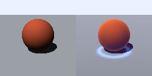
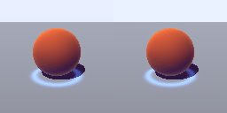

# Neural Hybrid Rendering Toy

A small side quest in hybrid rendering: use simple analytic 3D geometry to provide structure, then let a neural network invent the final look.

## Try Me

```
uv run neural_hybrid_renderer_minimal.py --steps 10000 --width 128 --height 128 --outdir hybrid_render_out --device cuda
```


## Look!





## What this is

This project renders a very small scene — a sphere over a plane — with a movable camera. It first computes a set of geometric buffers in the classical way:

- normals
- depth
- object masks
- hit mask
- baseline shading
- view direction
- world position

Those buffers are then fed into a small neural model which predicts a **stylised residual** on top of the baseline render.

So the rough idea is:

> classical geometry for structure, neural rendering for appearance

We are not trying to be physically correct. We are trying to see how far a learned image formation stage can go when given enough 3D hints to stay spatially coherent.

## Why

This started from a simple challenge:

> do we really need the full classical graphics pipeline for every part of the image, if the final object is always just a 2D screen that needs to look cool?

Rather than replacing everything, this experiment explores a hybrid answer:
- keep explicit 3D geometry and visibility
- replace the final shading style with a learned model

That gives us a toy setting where we can ask useful questions about inductive bias, coherence, and what kind of neighbourhood structure rendering actually wants.

## What we found

### 1. Per-pixel MLP
A tiny MLP can learn **local shading logic** surprisingly well:
- rim light
- local colour behaviour
- some object-conditioned effects

But it does not really capture broader spatial effects like the long-range contact glow or stylised plane behaviour.

### 2. Image-space CNN
A CNN does much better on broader effects because it has spatial inductive bias.

That immediately improved:
- contact region structure
- broader nonphysical lighting patterns
- general “this looks like a coherent style” behaviour

But it also introduced a structural failure:
- artifacts near the plane/sky horizon

That turned out not to be just a training bug. It exposed a real issue with ordinary image-space convolution: nearby pixels in screen space are not always meaningful neighbours in scene space.

### 3. Partial / mask-aware convolution
Replacing ordinary convolution with a partial-conv style layer helped a lot.

That reduced the boundary artifact substantially, which supports the idea that one of the main problems was **invalid-neighbour contamination across visibility boundaries**.

### 4. View distribution matters too
Some remaining failures came from extreme camera viewpoints, especially high views.

Those were fixed much more by changing the **training distribution** than by adding more hacks to the model. In other words:
- some errors were architectural
- some were just coverage

## Current takeaway

The toy seems to support a fairly nice middle position:

- the classical pipeline is not sacred
- but geometry still matters a lot
- learned appearance works surprisingly well when conditioned on good structural buffers
- the choice of operator matters
- plain screen-space locality is not always the right notion of locality for rendering

So the current thesis is something like:

> a stylised renderer can be learned on top of simple 3D buffers, but coherence depends strongly on both the geometry hints and the neighbourhood structure used by the neural model.

## What is in the code

At the moment the script includes:
- analytic ray intersections for a sphere and plane
- G-buffer construction
- a hand-crafted nonphysical target shader
- multiview dataset generation
- residual neural rendering
- partial-convolution model
- export of training/test examples
- groundwork for making animated camera paths

## Next obvious steps

- render a GIF of a smooth fly-around path
- probe temporal coherence under motion
- try feeding previous-frame information
- compare image-space models with more scene-aware neighbourhoods

## Tone-setting summary

This is not a serious renderer. It is a deliberately tiny experiment that keeps asking a serious question:

> how much of “rendering” is really geometry, and how much is just a learned appearance prior living on top of geometry?

So far the answer seems to be: a lot more can be learned than you might expect, but the moment you do that, the model’s notion of locality becomes the whole game.
